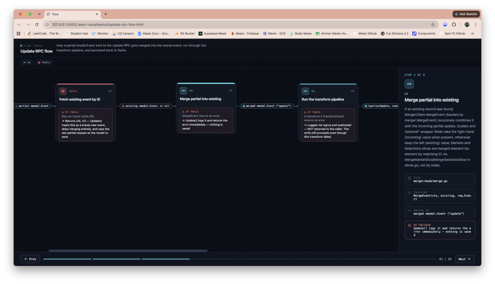
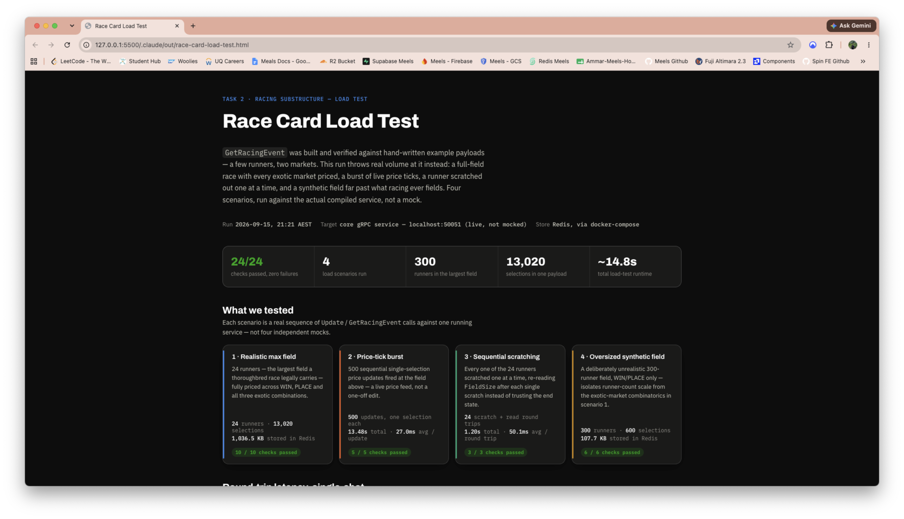
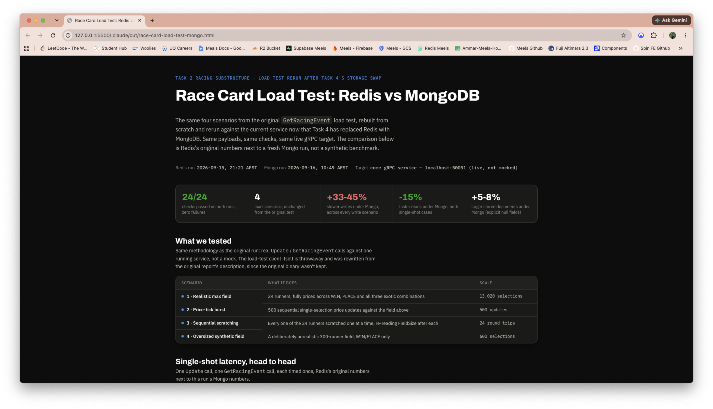

# Process

This is a short walkthrough of how I worked through the five tasks. More detailed documentation for each task are written up per task in `docs/task-0N-*.md`.

## 1. Read the task first

Before writing any code I read `README.md` fully, then read the existing code:
`model/`, `merger/`, `core/service/`, `core/repository/`, `core/transforms/`. I wanted to
find the patterns already in the codebase instead of inventing my own.

From that I made a plan across all five tasks before starting task 1, so I'd walk into
each one already knowing the patterns I'd be reusing and the specific calls I'd need to
make a judgment on, like task 1's Display/Hidden polarity, or task 2's Selection vs
Runner question.

The pattern that mattered most across the whole test: every field on the model has to be
wired in three places (proto, merger, response conversion) or it silently disappears. No
compile error, no test failure unless you specifically test that field. Once I saw that, it
shaped how I approached every other task.

## 2. Learning the codebase and the stack

I used my own `learn-visualise` tool ([open source on my github](https://github.com/AmmarAS03/skills/tree/master/skills/learn-visualise)) to help me learn the existing
flow and understand the project on a high level.

This was also my first time going this deep with Go and gRPC in this shape (generated
proto types, hand written mergers, a transform pipeline), so I read around online for Go
and gRPC conventions where the code itself wasn't enough to make a confident call.

## 3. Plan, then build, then review

For each task I used three agents I built for this codebase, one job each, so planning,
building, and reviewing stayed separate instead of one pass trying to do everything.
They're not public yet. The idea of splitting the work this way was inspired by patterns
I'd seen from [Matt Pocock](https://github.com/mattpocock) and [Affan Mustafa](https://github.com/affaan-m) on GitHub.

**Saper** plans. It reads the actual code rather than guessing file paths, finds the
closest existing pattern for the task, and applies YAGNI: don't recreate something that
already exists, don't reshape a widely used function without a real reason. It runs the
three places check up front for every field it plans to touch, and it's told to stop and
ask rather than guess when something's ambiguous. That's where task 2's Selection vs
Runner question got raised before any code existed, not after.

**Kapu** builds. It reads Saper's plan, checks it against the current code (not just
trusts it), and implements one step at a time. Proto changes go in first with an
immediate regen. It never commits or pushes, that stays with me.

**Gendis** reviews. It reads the plan and the diff independently, re-runs the three
places check, traces every changed function to its callers, and grades what it finds as
Critical, Medium, or Small, plus anything from the plan that didn't actually get done.

Every task went through this cycle before I opened a PR.

## 4. Load testing, not just integration tests

The existing integration tests hit a real local Redis or Mongo and check correctness, but
they don't say anything about behaviour under load. After task 2 and again after task 4 I
wanted to actually stress test what I'd just built, so I used a fourth agent whose only
job is: understand the function, think through the main path and the edge cases, build a
load test, and turn the result into something visual.

After task 2, on the new racing read path:

After task 4, Redis against MongoDB head to head:

The full interactive versions are in `.claude/out/race-card-load-test.html` and
`.claude/out/race-card-load-test-mongo.html`. Correctness tests tell you it works, load
tests told me where the new structures actually cost something under sustained writes.
That felt worth doing for a codebase like this one.

## 5. Task 5: scalability as the main constraint

`SearchEvents` is the one RPC that runs across the whole collection instead of by ID, and
this repo already shows that the set of searchable fields grows over time (task 2 added a
whole new thing to search for). So scalability wasn't an afterthought here, it was the
main design constraint. `docs/task-05-search.md` has a section on it, but the short
version:

- Filtering happens server side in Mongo's `find()`, not by pulling every event back and
  filtering in Go.
- Three single field indexes instead of one compound index, because the filters are all
  independently optional and a compound index only really serves one combination of them.
- The response is a lean `EventSummary`, not the full nested event, so cost scales with
  how many results match, not with the full shape of each one.

## Where the rest lives

Everything above is how I worked. What I actually built and why, per task, is in
`docs/task-01-display.md` through `docs/task-05-search.md`.
