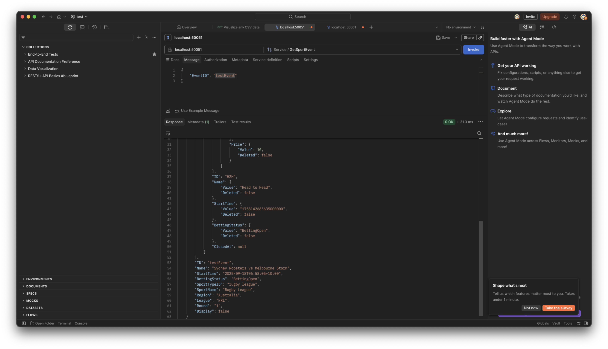
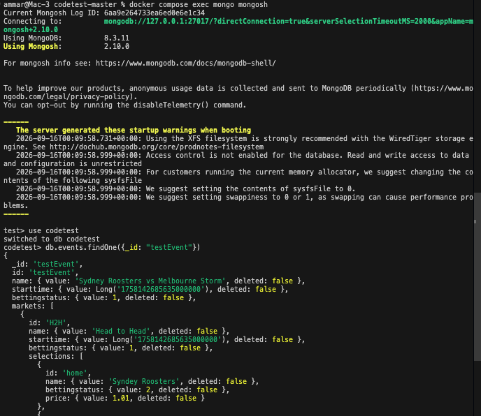

# Task 4: Swap Redis for MongoDB

> Swap out the Redis database technology for MongoDB. Remember we are using
> vendoring so you will need to run `go mod tidy` and `go mod vendor` in the
> root folder after adding any new dependencies

## What changed

| File | Change |
|---|---|
| `core/repository/redis.go` | Deleted |
| `core/repository/mongo.go` | New. `mongoRepo` + `NewMongoRepository`, using `go.mongodb.org/mongo-driver/v2` |
| `core/repository/types.go` | `Repository` gains `Close(ctx context.Context) error` |
| `core/repository/redis_test.go` | Deleted |
| `core/repository/mongo_test.go` | New. Full-fixture round trip via `proto.Equal`, plus a dedicated not-found case |
| `core/cmd/core/main.go` | Constructs `NewMongoRepository` instead of `NewRedisRepository`; calls `repo.Close` on shutdown |
| `core/service/implementation_test.go` | 5 call sites switched to `NewMongoRepository`, each now closes the repo too |
| `internal/modeltest/fixtures.go` | New. `PopulatedEvent()` and friends, extracted from `merger/modelmerge_test.go` so the Mongo round-trip test and the merger completeness tests share one fixture |
| `merger/modelmerge_test.go` | Uses `modeltest.PopulatedEvent()` etc. instead of local unexported fixtures |
| `docker-compose.yml` | `redis` + `redis-commander` replaced with `mongo:8` + `mongo-express` |
| `go.mod` / `go.sum` | Dropped `github.com/redis/go-redis/v9`; added `go.mongodb.org/mongo-driver/v2` |
| `vendor/` | New. First `go mod vendor` in this repo's history |

`model/event.proto`, `core/core.proto`, `merger/modelmerge.go` (production code),
`core/package.go`, and every transform needed no changes. This task swaps the
storage engine underneath an unchanged `Repository` interface (aside from
`Close`), so nothing that reads or merges fields changes.

## Decisions

### Native BSON, not an opaque blob

Redis stored `json.Marshal(event)` as an opaque string. Redis could not see
inside it, and the only supported access pattern was fetch-by-ID. Rather than
reproduce that limitation inside Mongo (`bson.M{"blob": json.Marshal(event)}`),
`UpdateEvent` passes the proto struct straight to the driver, which BSON-marshals
it as a real nested document:

```js
db.events.findOne({_id: "testEvent"})
{
  _id: "testEvent",
  name: { value: "Sydney Roosters vs Melbourne Storm", deleted: false },
  markets: [{ id: "H2H", closedat: { value: ..., deleted: false }, ... }],
  display: null,
  ...
}
```

This is what makes Task 5's `SearchEvents` a server-side query
(`coll.Find(ctx, bson.M{"display.value": true})`) instead of a fetch-everything
scan in Go. The driver lowercases Go field names and ignores `json` tags, so
the queryable path for `Display` is `display.value`, not `Display.Value`.

### The `(nil, nil)` not-found contract

All three service call sites (`core/service/implementation.go`) branch on
`existing == nil`, never on a sentinel error. `GetEventByID` translates
`mongo.ErrNoDocuments` back into `(nil, nil)` to preserve that:

```go
err := c.events.FindOne(ctx, bson.M{"_id": id}).Decode(event)
if errors.Is(err, mongo.ErrNoDocuments) {
    return nil, nil
}
```

Getting this wrong would fail the first write of every new event (`Update`
returns the error before the "New Event born" branch runs) and turn both
getters' "not found" response into a gRPC error. `mongo_test.go` has a
dedicated test for it, since nothing tested this behaviour under Redis either.

### `Repository` gains `Close`

The Mongo driver holds a connection pool and background monitoring goroutines
and documents `Disconnect` as required at shutdown. go-redis was never closed
either and nobody noticed, but leaving a new dependency's goroutines running
was judged worth the one-line interface change. `mongoRepo` is the sole
implementation, so nothing else breaks.

### Server-selection timeout capped at 5 seconds

The driver's default server-selection timeout is 30 seconds. With Mongo
unreachable, that turned every construction site, including test setup, into
a 30-second hang instead of a fast, clear connection error. `NewMongoRepository`
sets `SetServerSelectionTimeout(5 * time.Second)` on the client options so an
unreachable database fails fast.

### Health-check failure disconnects the client

If `mongo.Connect` succeeds but the follow-up health check fails,
`NewMongoRepository` now calls `client.Disconnect` before returning the error.
Without it, the driver's background monitoring goroutines from the successful
`Connect` would keep running with nothing left to stop them.

## Verifying

```sh
docker compose up -d
go build ./...
go vet ./...
go test ./... -short -cover
./core/check.sh
```

Prove it's really Mongo. Run the service and inspect the stored document:

```sh
./run_local.sh
# Update with exampledata/01_new_event.json, then GetSportEvent {"EventID": "testEvent"}

docker compose exec mongo mongosh
> use codetest
> db.events.findOne({_id: "testEvent"})
```

`mongo-express` at `localhost:8081` is the visual equivalent of the old
`redis-commander`.

**Screenshots from this exact flow:**



`GetSportEvent {"EventID": "testEvent"}` in Postman, called right after `Update`
with `01_new_event.json`. The response carries the full merged event back,
including the `H2H` market and its selections, confirming the write went
through the new Mongo-backed repository and came back out the other side.



The same event, found directly in `mongosh` with `db.events.findOne({_id:
"testEvent"})`. This is the proof the data actually lives in MongoDB, not
Redis: a real nested BSON document with `name.value`, `starttime.value` as a
`Long`, and `markets` as a proper array, not a JSON string blob.

**Regression sweep.** The storage swap must be invisible to Tasks 1 through 3.
Replayed each earlier task's payloads against Mongo directly through the
running service:

| Task | Payloads | Result |
|---|---|---|
| 1 | `03_hide_event.json`, `04_show_event.json` | `Display` toggles on `GetSportEvent`; unaffected by unrelated updates |
| 2 | `05_new_race.json`, `06_scratch_runner.json` | `GetRacingEvent` returns 3 runners with joined prices; `FieldSize` drops 3 to 2 on scratching, runner metadata survives |
| 3 | `08_close_market.json`, `09_reopen_market.json` | `ClosedAt` stamped on first close and frozen across reopen then reclose |


## Notes / limitations

- **Tests share a live database with dev data.** Today `./run_local.sh` and
  the test suite point at the same `codetest` database, same as the single
  Redis DB 0 before it. This is deliberate parity, not an oversight.
  Inventing a separate test database was out of scope for a like-for-like
  swap.
- **All service and repository tests hard-require a live database.** There
  are no mocks and no `t.Skip`/`testing.Short` guards, so `go test -short`
  runs them regardless. With the 5-second server-selection timeout, a down
  database now fails each construction site in about 5 seconds instead of
  hanging for 30; the tests still fail, just faster and with a clear cause
  instead of a nil-pointer panic.
- **`Update` is still a read-modify-write with no compare-and-swap.**
  `GetEventByID` then merge then `UpdateEvent` can lose concurrent writes.
  `ReplaceOne` has the same blind-overwrite semantics as Redis `SET`, so this
  is not a regression, but Mongo is where it could eventually be fixed (for
  example an optimistic-concurrency filter). Worth naming rather than leaving
  undiscovered.
- **BSON writes explicit `null` for unset `Optional*` fields**, unlike the
  `json:",omitempty"` tags used under Redis. Round-trips are unaffected (null
  decodes back to a nil pointer) and documents are marginally larger. For
  Task 5 this is the correct behaviour: a query like `{"display.value": true}`
  should not match an event whose `Display` was never set.
